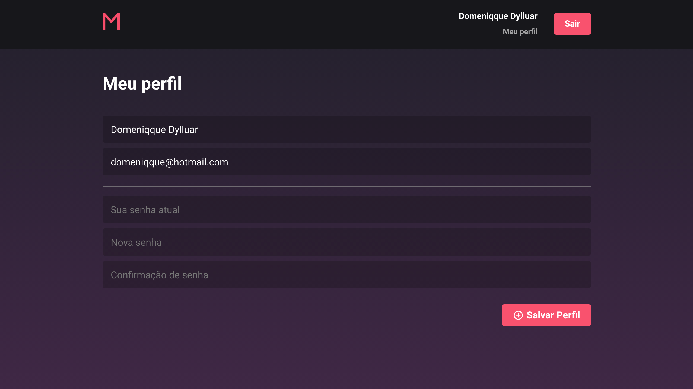

# MeetApp

This is the frontend of a meetup scheduling system made with ReactJS.

## Used technologies

- React Js & React Hooks
- React Router
- StyledComponents & Polished
- Redux, Redux Saga & Redux Persist
- Eslint, Prettier & prop-types
- Data immutability using Immer
- Axios, date-fns, react-datepicker, @rocketseat/unform
- Reactotron

## To install

First make sure you have the working [api available](https://github.com/Domeniqque/desafio-gostack-meetapp).

After cloning the project, run it in your directory:

```bash
$ yarn && yarn start
```

To start the project next time just run:

```bash
$ yarn start
```

## Screen Views

### Sign In and Sign Up


### Profile Screen



### Meetups


This application was created for conclusion of [Rocketseat](https://github.com/Rocketseat) Bootcamp 9.

## Links

- [API](https://github.com/Domeniqque/desafio-gostack-meetapp)
- [Mobile App]()
